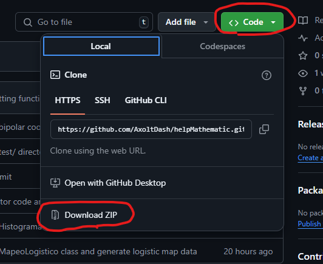
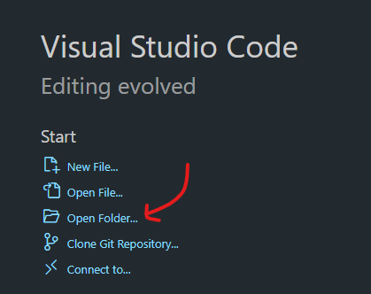
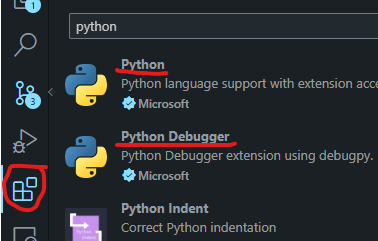
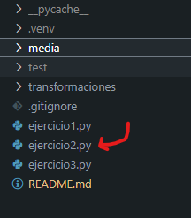
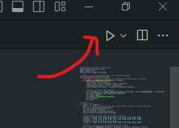

# Proyecto para un amigo matemático

## 📥 Cómo descargar:
Aquí mismo en esta [web](https://github.com/AxoltDash/helpMathematic/tree/transformaciones) en la que te encuentras darás click en el botón donde dice `Code` y le darás click en `Descargar Zip`, una vez que tengas tu archivo en tu computadora descomprimelo y tendras todos los archivos. 



Si quieres probar tu proyecto te recomendamos seguir las siguientes instrucciones

## 🔧 Configuración:
### Instalación de Bibliotecas (Si quieres ejecutarlo en tu PC):
**Te recomiendo encarecidamente que instales *Visual Studio Code* para que puedas ejecutar tu código sin problemas, en caso de que no, busca un tutorial de intenet para hacer los siguientes pasos**

Para ejecutar el código necesitas instalar las bibliotecas (No olvides tener instalado python3 y pip en tu PC)
Puedes instalar las bibliotecas desde una terminal dentro de la carpeta ya descomprimida, si estas usando Visual Studio Code puedes abrir la terminal con Ctrl + \` cuando abras tu carpeta.



Ahora sigue las siguientes instrucciones para instalar tu entorno virtual y las librerias necesarias:

### Crear un entorno virtual en Visual Studio Code:
   - Crea un entorno virtual con el siguiente comando cuando tengas la terminal abierta:
     ```bash
     python -m venv .venv
     ```
   - Activa el entorno virtual:
     - En Windows:
       ```bash
       .venv\Scripts\activate
       ```
     - En macOS/Linux:
       ```bash
       source .venv/bin/activate
       ```

### Seleccionar el intérprete de Python en Visual Studio Code:
   - En VS Code, abre la paleta de comandos (`Ctrl + Shift + P`) y escribe `Python: Select Interpreter`.
   - Selecciona el entorno virtual que acabas de crear (`.venv`).

### Instalar Bibliotecas
Una vez que estes dentro del .venv instala las bibliotecas ejecutando una por una de las siguientes lineas de código:

```bash
pip install matplotlib
pip install numpy
```

### 🎉 Listo!
Ahora ya podrás ejecutar el código! Seguramente mientras estabas haciendo esto VS Code te recomendó instalar extensiones de Python, para ello dale click a loss cuadritos de la izq. de tu pantalla e instala **Python Debugger** y **Python** hechos por Microsoft



## 🚴 Ejecutar

Para ejecutar to código es tan simple como seleccionar el `archivo.py` que quieras ejecutar y darle al boton de `PLAY` en la esquina sup. derecha de tu pantalla.

 

## ⚠️ Nota

Los archivos llamados `ejercicio1.py`, `ejercicio2.py`, `ejercicio3.py` son los ejercicios correspondientes a tu entrega proxima.

Los archivos que son para el Miércoles son los que se encuentran en la carpeta `/transformaciones`. Como mencionamos tuvimos distintas versiones de los archivos siendo marcados con `OpcionA` y `OpcionB`
La unica que esta bien es la a) llammada `factorCambioDeArea.py`

Recuerda, todo lo dem.as esta bien :D


